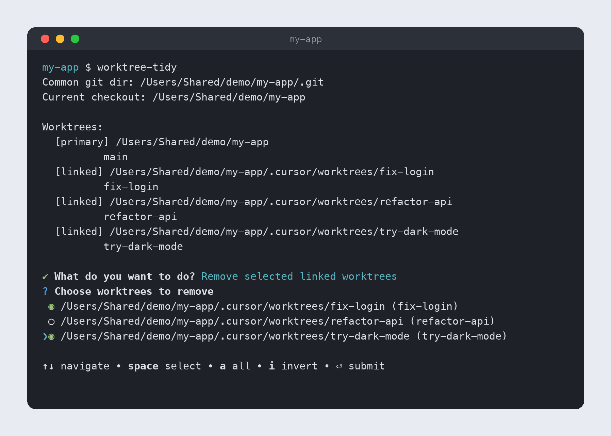

#  worktree-tidy

Tidy up the pile of git worktrees your AI agents leave behind

Windows · macOS

<!-- media: hero -->


[Watch it run (14 seconds)](docs/demo.mp4)
<!-- /media: hero -->

Previously called `worktrees`.

## What it is

I use this when Cursor leaves a pile of linked checkouts under `.cursor/worktrees`. It lists every worktree in the repo you're in, marks which is the primary and which are linked, and lets you pick some (or all the linked ones) to delete.

It never lets you remove the primary checkout, and it asks before deleting anything. If a worktree has uncommitted changes it shows you the files first, so you don't lose work by accident. Ignored env files like `.env.local` get the same treatment, because Git deletes ignored files with the worktree and those often hold keys that only live in that folder.

## Get it

Paste this into your AI coding agent (Claude Code, Codex, Cursor...):

> Clone https://github.com/mikecann/worktree-tidy and make it my own. It's one of Mike
> Cann's personal tools, so read the README first, change anything specific to his
> setup to suit mine, then help me get it running.

### Or set it up by hand

You'll need [Bun](https://bun.sh) and Git on your PATH. No API keys or `.env` file needed.

```bash
git clone https://github.com/mikecann/worktree-tidy.git
cd worktree-tidy
```

On macOS:

```bash
bash install.sh
```

This runs `bun install` and links `worktree-tidy` into `~/.local/bin`. If that folder isn't on your PATH, add this to `~/.zshrc` and open a new terminal:

```bash
export PATH="$HOME/.local/bin:$PATH"
```

You can choose another directory with `bash install.sh /path/to/bin`, or pass `--skip-deps` if dependencies are already installed. `install-to-path.sh` only installs the launcher.

On Windows, from PowerShell:

```powershell
powershell -NoProfile -ExecutionPolicy Bypass -File .\install.ps1
```

This runs `deps.ps1` to install Bun dependencies and writes `worktree-tidy.bat` and a Git Bash wrapper into `C:\dev\tools`. Add that folder to your user PATH in Windows Environment Variables and open a new terminal. You can pass `-ToolsDir 'C:\your\bin'` to use another folder, or `-SkipDeps` to skip dependency installation. Keep the clone's path to ASCII characters because the Windows stub uses ASCII encoding.

The installed command points back to this clone, so code changes take effect immediately. Re-run the installer if you move the clone.

## Using it

From any directory inside the Git checkout you want to tidy:

```bash
worktree-tidy          # choose linked worktrees to remove
worktree-tidy --force  # same as -f, passes --force to git worktree remove
```

Pick selected linked worktrees or all linked worktrees, then confirm. If any are dirty, it shows modified and untracked files and asks for a separate confirmation before force-removing them. If any contain ignored `.env*`, `*.env` or `.dev.vars*` files (outside `node_modules`, and including ones inside ignored folders like `.vercel/`), it lists those and asks before deleting them too. `--force` still asks for those confirmations.

If you deleted a worktree's folder by hand, Git still remembers it and lists it as prunable. worktree-tidy shows those as `[prunable]` with Git's reason, and offers to clean up the stale records with `git worktree prune` after you confirm. If a prunable worktree was on a detached HEAD, it shows the commit, because pruning can drop Git's last reference to it.

There is no non-interactive batch mode. To run without installing a command, first run `bun install` in this clone, then call `bun run /path/to/worktree-tidy/index.ts` from the checkout you want to tidy. On macOS, `bash /path/to/worktree-tidy/run.sh` works too.

## How it works

| Step | Detail |
|---|---|
| Detect repo | Uses `git rev-parse --show-toplevel` from your current directory. Any subfolder inside a checkout is fine. |
| List | Reads `git worktree list --porcelain` and labels checkouts as primary, linked, locked or prunable. A linked checkout has its own Git directory inside the repo's shared one, so this works with `--separate-git-dir` repos too. Prunable ones are records whose folder, or the folder's `.git` file, is already gone. |
| Remove | Only linked worktrees are selectable. Locked ones are listed with their reason but left alone, because Git refuses to remove them. Run `git worktree unlock` first if you want one gone. Removals run `git worktree remove`. |
| Prune | Offered when Git reports prunable worktrees. Runs `git worktree prune`, which only drops Git's own records and never deletes folders. |
| Confirm | Shows local changes and ignored env files, asks before deleting them, then asks for final confirmation. Pruning asks too. Confirmed dirty worktrees are removed with `--force`. |

## Uninstall

On Windows:

```powershell
powershell -NoProfile -ExecutionPolicy Bypass -File .\uninstall.ps1
```

Use the same `-ToolsDir` if you chose a custom directory. It removes only this tool's two stubs and leaves the shared directory and PATH alone.

On macOS, remove the installed link:

```bash
rm "$HOME/.local/bin/worktree-tidy"
```

## Tests

From this clone:

```bash
bun install
bun test
```

The integration tests create temporary Git repos and worktrees. The macOS launcher test also checks installation from a path with spaces, argument forwarding, and the caller's working directory.

## Icon

`icons/worktree-tidy.png` is `application_view_list.png` from the [FamFamFam Silk](https://www.famfamfam.com/lab/icons/silk/) set (Mark James, [CC BY 2.5](https://creativecommons.org/licenses/by/2.5/)). The icon keeps its original licence and credit.

## More tools

You can find my other tools at [mikerosoft.app](https://mikerosoft.app).

MIT licensed.
